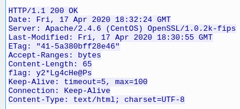
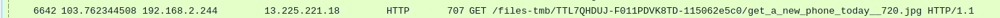
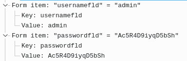
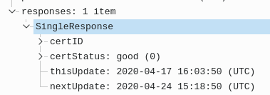
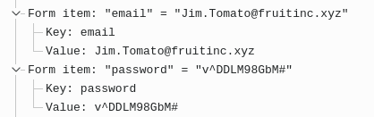
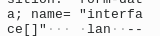

# WireDive

## Forensic, 6275 points

### Description

WireDive is a combo traffic analysis exercise that contains various traces to help you understand how different protocols look on the wire.

Author: [DFA and Johannes Weber](https://twitter.com/webernetz)

### Solution

For this lab, I will explain my methodology on the HTTPS traffic questions, which I think are the most relevant in this exercise, thus I will not deal with questions with `dns.pcapng` for instance.

This part deals with HTTPS traffic, through TLS encryption then. The lab gave us an NSS Key Log Format file, which I recognized with its first line `# SSL/TLS secrets log file, generated by NSS` which is meant to be added to Wireshark or any tool alike, to decrypt these encrypted packets. Indeed, in the NSS file, there are secrets such as `SERVER_TRAFFIC_SECRET_0` or `CLIENT_HANDSHAKE_TRAFFIC_SECRET`. For more information on how to decrypt HTTPS traffic with NSS Key Log Format files, please check [this Mozilla documentation](https://developer.mozilla.org/en-US/docs/Mozilla/Projects/NSS/Key_Log_Format).

Once the traffic is decrypted, I started right away to analyze these packets.

#### Q32) File https.pcapng - What has been added to web interaction with web01.fruitinc.xyz?

Okay, let's focus on packets dealing with the host `web01.fruitinc.xyz` then. I used this filter: `http.host == "web01.fruitinc.xyz"`

The packets 675 and 707 matched my filter, I follow 675's HTTP stream to get more information, as at the moment I don't have anything. I noticed then a weird HTTP header, known as `flag`. Its value is the answer: `y2*Lg4cHe@Ps`



#### Q33) File https.pcapng - What is the name of the photo that is viewed in slack?

After applying a `http` filter, I scrolled a bit to understand what requests have been done, and one occurred to a weird JPG picture. Turns out its name is the answer: `get_a_new_phone_today__720.jpg`.



#### Q34) File https.pcapng - What is the username and password to login to 192.168.2.1? Format: 'username:password' without quotes.

I guessed that the `192.168.2.1` is the remote server, I will use this information in my filter then. Also, authentication is often dealt with POST requests, hence with forms, using most of the time the `application/ x-www-form-urlencoded` value in the Content-Type header, like explained in [this Medium article](https://medium.com/@rajajawahar77/content-type-x-www-form-urlencoded-form-data-and-json-e17c15926c69). Thereby, my filter is the following: `urlencoded-form and ip.dst==192.168.2.1`

It matches some packets, I inspect the first one, the 937th, and can observe the admin's credentials easily: `admin:Ac5R4D9iyqD5bSh`.



#### Q35) File https.pcapng - What is the certStatus for the certificate with a serial number of 07752cebe5222fcf5c7d2038984c5198?

Okay, the only information I have about the certificate is its serial number, let's use that! After using a template from a random certificate, I designed my filter this way: `ber.64bit_uint_as_bytes == 07:75:2c:eb:e5:22:2f:cf:5c:7d:20:38:98:4c:51:98` after doing a little trick with `sed`:
```bash
$ echo '07752cebe5222fcf5c7d2038984c5198' | sed 's/../&:/g;s/:$//'
07:75:2c:eb:e5:22:2f:cf:5c:7d:20:38:98:4c:51:98
```

I take a random `Online Certificate Status Protocol` (OCSP) and inspect its `certStatus` value which is `good`.



#### 36) File https.pcapng - What is the email of someone who needs to change their password?

Same idea than Q34) without the remote server information, hence my filter is simply `urlencoded-form`. By having a look at different decrypted traffic, I found an email, along with a password, in a form, seems to be my winner: `Jim.Tomato@fruitinc.xyz`



#### 37) File https.pcapng - A service is assigned to an interface. What is the interface, and what is the service? Format: interface_name:service_name

I guess this is about the server, let's focus on `192.168.2.1` as the destination IP address. Then, I can use either with that a `http` or `http2` filter, as I guess that the service is reachable through HTTP, as I investigate a file called `https.pcapng`.

I tried this filter first: `http and ip.dst==192.168.2.1` and found nothing interesting. Then, with this one: `http2 and ip.dst==192.168.2.1` I noticed the packets 1076 and 1107 dealing with some GET and POST to `/services_ntpd.php`. It seems like a service daemon: NTP daemon. Let's be sure of that by searching for the NTP protocol online. I found [that definition](https://fr.wikipedia.org/wiki/Network_Time_Protocol) which makes sense.

I now need to know on what interface it is binded. I opened the next packets, still with my former filter, and found out in packet 1108 some interesting entries: 



The interface name is `lan` then!